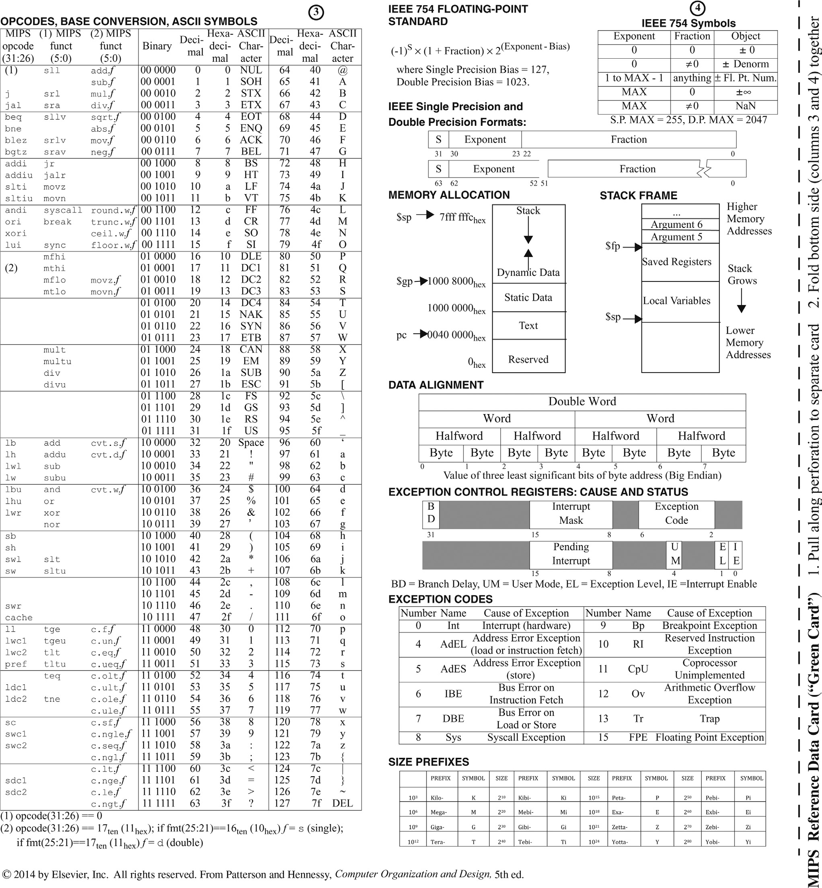

# MIPS-Assembler

***Note:*** _this code is currently ***INCOMPLETE***._

My attempt at writing an assembler for MIPS architecture in Python.
This code will take a ***text file*** written in MIPS assembly language ***as input*** and spit ***out*** a ***text file*** filled with 1's and 0's translated from the input.

# MIPS Instructions Reference

